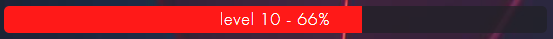
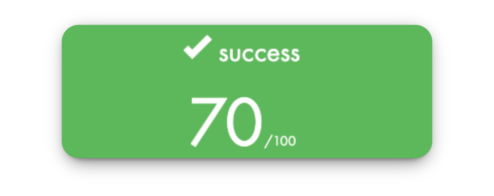
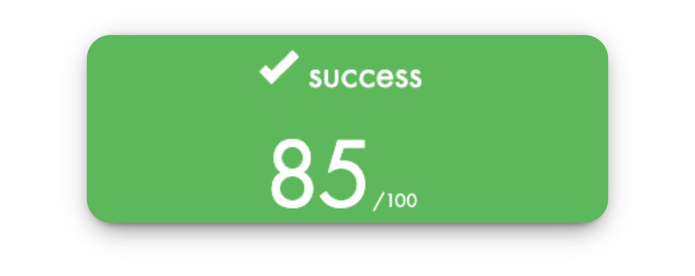

# Piscine 42

En **juillet 2025**, j’ai participé à l’**épreuve de sélection de [l’École 42](https://42.fr/)**, surnommée *la Piscine*.  
Un mois d’immersion totale où chaque jour se résume à **coder, comprendre, échouer, recommencer… jusqu’à progresser**.  

La Piscine, ce n’est pas seulement du code : c’est **apprendre à apprendre**, repousser ses limites et développer une **vraie résilience** face à la difficulté. C’est aussi une **expérience humaine unique**, où l’on partage autant les réussites que les échecs.

Après un mois de travail acharné et une immersion totale dans la Piscine, j’ai atteint le niveau 10,66. Aujourd’hui, **je suis fier d’avoir réussi cette épreuve** et d’avoir été sélectionné pour **la rentrée de novembre 2025** à **l’École 42 Paris**.

  

Ce dépôt n’a pas vocation à fournir des solutions toutes faites.  
Il représente avant tout un **journal de bord**, un moyen de garder une **trace de mon évolution** et de mon **apprentissage**. 

---

⚠️ **Note importante :** Si tu es en train de vivre la Piscine, n’essaie pas de tricher en recopiant du code trouvé ailleurs.  
Tu n’y gagneras rien, tu passeras à côté de l’essentiel… et le **Bocal a toujours un œil sur toi**.  

---

### [Shell00](https://github.com/Niftix/Piscine_42/tree/main/shell00)

La Piscine débute par le **Shell** : une plongée directe dans les bases du terminal Linux.  
Créer, déplacer et supprimer des fichiers, gérer les permissions, manipuler les répertoires… tout ce qu’il faut pour apprendre à **se débrouiller sans interface graphique.** 

 

La mise en route est compliquée, mais **on se fait très rapidement la main.**  
C’est la première étape avant de toucher au C, et elle pose les fondations indispensables pour la suite du cursus.  

---

### [Shell01](https://github.com/Niftix/Piscine_42/tree/main/shell01)

Après avoir pris nos marques avec les bases du Shell, ce day vient ajouter une **couche de complexité**.  
On y découvre les **liens symboliques**, la gestion plus fine des **permissions**, les commandes un peu plus poussées…  

 

La logique reste la même : **pratiquer, se tromper, recommencer**.  
Ce ne sont clairement pas mes days favoris, mais il faut commencer par là pour être à l’aise tout au long de la **Piscine**.  

---

### [C00](https://github.com/Niftix/Piscine_42/tree/main/c00)

Enfin… le **C** ! Après les journées un peu rébarbatives du Shell, ce module sonne comme une vraie délivrance.  
On met les mains dans le code, on écrit nos **premières fonctions en C**, et on commence à comprendre la logique derrière la programmation.  

 

Je termine ce module à **85%**. J’ai volontairement laissé `ft_print_comb` de côté, bien trop difficile à ce stade.

Le day en lui-même reste un bon souvenir. Avec `ft_putnbr`, j’ai eu un premier aperçu de la **récursivité**. Un concept un peu vertigineux au début, pas évident à digérer aussi tôt, mais qui donne cette sensation de vraiment toucher à la logique profonde du langage C.  

Quant aux fameux exercices bonus… le plan de revenir dessus plus tard n’aura jamais tenu. Spoiler : `ft_print_comb` ne sera jamais fait, tout comme d’autres bonus laissés sur le côté. À la Piscine, le temps finit toujours par rattraper tout le monde. 

---

### [C01](https://github.com/Niftix/Piscine_42/tree/main/c01)

C01 est un **day clé de la Piscine** : c’est ici qu’on découvre vraiment les **pointeurs** et la **manipulation de strings**.  Au début, ça peut paraître abstrait, mais il ne faut surtout pas hésiter à prendre du temps dessus, car c’est un concept fondamental en C. 
Une fois la logique comprise, le day devient beaucoup plus clair et abordable.  

Le dernier exercice introduit le **bubble sort**, un algorithme de tri simple mais essentiel à connaître. C’est vraiment à ce moment-là que l’on sent que les bases commencent à s’installer pour la suite de la Piscine.  

---

### [C02](https://github.com/Niftix/Piscine_42/tree/main/c02)

Sur ce day nous attaquons sérieusement la **manipulation de strings**.  

Ici, on recrée à la main plusieurs fonctions de la librairie standard : `ft_strcpy`, `ft_strncpy`, `ft_strlcpy`… la difficulte reside dans le fait de bien les comprendre de l’intérieur pour maitriser leurs differences.

Je finirai ce day à **85%**.  J’avais volontairement laissé l’exercice bonus `ft_print_memory` pour plus tard, car il me paraissait trop difficile à ce stade. En réalité, comme beaucoup d’autres bonus, je n’y reviendrai jamais…
 
---

### [C03](https://github.com/Niftix/Piscine_42/tree/main/c03)

On continue l’exploration des **strings** mais à un niveau supérieur.  Comme pour le day précédent, il faut vraiment prendre le temps de comprendre les différences et le fonctionnement des fonctions de la librairie standard.  Une fois cette étape franchie, ce day s’appréhende finalement assez facilement.  

C’est un day qui forge la patience et qui oblige à coder proprement, sinon… ça casse.  

---

### [C04](https://github.com/Niftix/Piscine_42/tree/main/c04)

Ce day commence en douceur, avec **trois exercices déjà rencontrés précédemment**, histoire de se mettre en jambe.  C’est aussi le moment de découvrir le fameux `atoi`, dont on entend parler depuis le début de la Piscine.  

En revanche, `atoi_base` et `putnbr_base` font clairement peur au premier abord.  Je ne les toucherai pas dans un premier temps, préférant avancer sur les days suivants. Mais tout change en arrivant à **C07** : l’exercice `convert_base` me semble tellement vertigineux que je me dis que je n’y arriverai jamais sans avoir fini les deux autres exercices de base, puisqu’il les reprend clairement.  

C’est à ce moment-là que je reviens sur C04 pour m’acharner sur eux.  Ces exercices restent assez **prise de tête**, et la moindre erreur s’y glisse facilement.  J’y ferai pas mal de fautes, mais à force de persévérance, je finirai par en venir à bout et valider ce day. 

---

### [C05](https://github.com/Niftix/Piscine_42/tree/main/c05)

On l’appelle souvent **le day des maths**, et rien que ça en fait fuir plus d’un. Pour ma part, je l’ai trouvé au contraire **plutôt cool** ! C’est ici qu’on joue vraiment avec la **récursivité**, et qu’on commence à voir toute sa puissance.  

Beaucoup préfèrent sauter ce day, mais honnêtement, il vaut vraiment le détour. Un exercice comme `ft_fibonacci` m’a permis de comprendre en profondeur le fonctionnement des **sous-tâches récursives** et le principe de **remontée de la pile d’appels**.  C’est un passage qui peut sembler abstrait, mais une fois qu’on a le déclic, ça change tout.  

Le dernier exercice, le fameux **10 dames**, est considéré comme l’un des plus coriaces de la Piscine. Grâce au **Rush01**, on entrevoit la solution avec la découverte du **backtracking**, indispensable pour espérer le réussir.  

J’aurais adoré le tenter ! Mais comme pour d’autres exercices bonus, je ne validerai pas celui-ci.  

---

### [C06](https://github.com/Niftix/Piscine_42/tree/main/c06)

Enfin les **paramètres du main** (`argc` et `argv`).  Rien de bien compliqué en soi : il s’agit surtout de comprendre comment récupérer et manipuler les arguments passés en ligne de commande.  

Pour ma part, j’avais déjà dû me confronter à ce sujet un peu plus tôt, dans un contexte où je n’avais pas vraiment le choix.  J’ai donc dû chercher, expérimenter et trouver une solution par moi-même.  Résultat : une fois arrivé sur ce day, tout me paraissait déjà beaucoup plus simple et naturel.  
