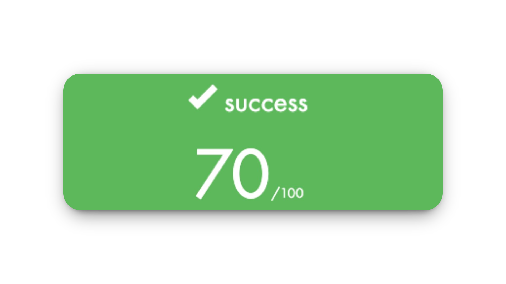

# Piscine 42

En **juillet 2025**, j’ai participé à l’**épreuve de sélection de [l’École 42](https://42.fr/)**, surnommée *la Piscine*.  
Un mois d’immersion totale où chaque jour se résume à **coder, comprendre, échouer, recommencer… jusqu’à progresser**.  

La Piscine, ce n’est pas seulement du code : c’est **apprendre à apprendre**, repousser ses limites et développer une **vraie résilience** face à la difficulté. C’est aussi une **expérience humaine unique**, où l’on partage autant les réussites que les échecs.

Après un mois de travail acharné et une immersion totale dans la Piscine, j’ai atteint le niveau 10,66. Aujourd’hui, **je suis fier d’avoir réussi cette épreuve** et d’avoir été sélectionné pour **la rentrée de novembre 2025** à **l’École 42 Paris**.

  

Ce dépôt n’a pas vocation à fournir des solutions toutes faites.  

Il représente avant tout un **journal de bord**, un moyen de garder une **trace de mon évolution** et de mon **apprentissage**. 

## Les days

Les **days** sont le cœur de la Piscine 42.  

Chaque day (C00, C01, …) propose une série d’exercices progressifs à réaliser en un ou plusieurs jours.  

Pour avancer, il faut valider le day en réussissant au minimum les **exercices obligatoires**, qui assurent la moyenne et débloquent l’accès au suivant. Les autres exercices sont alors considérés comme des **bonus** : ils permettent d’aller plus loin, de renforcer sa compréhension et de grappiller des points supplémentaires pour ceux qui veulent se challenger.

Une fois un day finalisé, il peut être soumis à la correction. Chaque exercice est alors évalué par **deux autres Piscineux**, qui jugent et notent le travail réalisé. C’est un moment clé de la Piscine : on échange, on compare nos approches et on met en pratique le **peer learning** de la meilleure façon possible.
  
Après ces deux corrections humaines, vient l’étape tant redoutée : la fameuse **moulinette**. 

Elle balance une pluie de tests automatiques sans pitié pour vérifier si ton code tient vraiment la route.  C’est un mélange bizarre entre stress et excitation : tu croises les doigts pour qu’elle ne te sorte pas un joli **“KO”**. Et quand, par miracle, le **“OK”** s’affiche… c’est la délivrance (jusqu’au prochain day) !

---

⚠️ **Note importante ⚠️**

Si tu es en train de vivre la Piscine, oublie l’idée de tricher en recopiant du code trouvé ailleurs.  Tu ne feras que **saboter ta Piscine**, rater tes exams et passer à côté de ce qui compte vraiment. 

La Piscine, c’est avant tout un mois pour apprendre à chercher, tester, échouer, recommencer et progresser. Parfois tu avances vite, parfois tu bloques longtemps sur un détail… et c’est normal. **Chacun nage à son rythme, l’important c’est d’aller de l’avant.**

---

### [Shell00](https://github.com/Niftix/Piscine_42/tree/main/shell00)

La Piscine débute par le **Shell** : une plongée directe dans les bases du terminal Linux.  
Créer, déplacer et supprimer des fichiers, gérer les permissions, manipuler les répertoires… tout ce qu’il faut pour apprendre à **se débrouiller sans interface graphique.** 

 

La mise en route est compliquée, mais **on se fait très rapidement la main.**  
C’est la première étape avant de toucher au C, et elle pose les fondations indispensables pour la suite du cursus.  

---

### [Shell01](https://github.com/Niftix/Piscine_42/tree/main/shell01)

Après avoir pris nos marques avec les bases du Shell, ce day vient ajouter une **couche de complexité**.  
On y découvre les **liens symboliques**, la gestion plus fine des **permissions**, les commandes un peu plus poussées…  

 

La logique reste la même : **pratiquer, se tromper, recommencer**.  
Ce ne sont clairement pas mes days favoris, mais il faut commencer par là pour être à l’aise tout au long de la **Piscine**.  

---

### [C00](https://github.com/Niftix/Piscine_42/tree/main/c00)

Enfin… le **C** ! Après les journées un peu rébarbatives du Shell, ce module sonne comme une vraie délivrance.  
On met les mains dans le code, on écrit nos **premières fonctions en C**, et on commence à comprendre la logique derrière la programmation.  

 

Je termine ce module à **85%**. J’ai volontairement laissé `ft_print_comb` de côté, bien trop difficile à ce stade.

Le day en lui-même reste un bon souvenir. Avec `ft_putnbr`, j’ai eu un premier aperçu de la **récursivité**. Un concept un peu vertigineux au début, pas évident à digérer aussi tôt, mais qui donne cette sensation de vraiment toucher à la logique profonde du langage C.  

Quant aux fameux exercices bonus… le plan de revenir dessus plus tard n’aura jamais tenu. Spoiler : `ft_print_comb` ne sera jamais fait, tout comme d’autres bonus laissés sur le côté. À la Piscine, le temps finit toujours par rattraper tout le monde. 

---

### [C01](https://github.com/Niftix/Piscine_42/tree/main/c01)

C01 est un **day clé de la Piscine** : c’est ici qu’on découvre vraiment les **pointeurs** et la **manipulation de strings**.  Au début, ça peut paraître abstrait, mais il ne faut surtout pas hésiter à prendre du temps dessus, car c’est un concept fondamental en C. 
Une fois la logique comprise, le day devient beaucoup plus clair et abordable.  

Le dernier exercice introduit le **bubble sort**, un algorithme de tri simple mais essentiel à connaître. C’est vraiment à ce moment-là que l’on sent que les bases commencent à s’installer pour la suite de la Piscine.  

---

### [C02](https://github.com/Niftix/Piscine_42/tree/main/c02)

Sur ce day nous attaquons sérieusement la **manipulation de strings**.  

Ici, on recrée à la main plusieurs fonctions de la librairie standard : `ft_strcpy`, `ft_strncpy`, `ft_strlcpy`… la difficulte reside dans le fait de bien les comprendre de l’intérieur pour maitriser leurs differences.

Je finirai ce day à **85%**.  J’avais volontairement laissé l’exercice bonus `ft_print_memory` pour plus tard, car il me paraissait trop difficile à ce stade. En réalité, comme beaucoup d’autres bonus, je n’y reviendrai jamais…
 
---

### [C03](https://github.com/Niftix/Piscine_42/tree/main/c03)

On continue l’exploration des **strings** mais à un niveau supérieur.  Comme pour le day précédent, il faut vraiment prendre le temps de comprendre les différences et le fonctionnement des fonctions de la librairie standard.  Une fois cette étape franchie, ce day s’appréhende finalement assez facilement.  

C’est un day qui forge la patience et qui oblige à coder proprement, sinon… ça casse.  

---

### [C04](https://github.com/Niftix/Piscine_42/tree/main/c04)

Ce day commence en douceur, avec **trois exercices déjà rencontrés précédemment**, histoire de se mettre en jambe.  C’est aussi le moment de découvrir le fameux `ft_atoi`, dont on entend parler depuis le début de la Piscine.  

En revanche, `ft_atoi_base` et `ft_putnbr_base` font clairement peur au premier abord.  Je ne les toucherai pas dans un premier temps, préférant avancer sur les days suivants. Mais tout change en arrivant à **C07** : l’exercice `convert_base` me semble tellement vertigineux que je me dis que je n’y arriverai jamais sans avoir fini les deux autres exercices de base, puisqu’il les reprend clairement.  

C’est à ce moment-là que je reviens sur C04 pour m’acharner sur eux.  Ces exercices restent assez **prise de tête**, et la moindre erreur s’y glisse facilement.  J’y ferai pas mal de fautes, mais à force de persévérance, je finirai par en venir à bout et valider ce day. 

---

### [C05](https://github.com/Niftix/Piscine_42/tree/main/c05)

On l’appelle souvent **le day des maths**, et rien que ça en fait fuir plus d’un. Pour ma part, je l’ai trouvé au contraire **plutôt cool** ! C’est ici qu’on joue vraiment avec la **récursivité**, et qu’on commence à voir toute sa puissance.  

Beaucoup préfèrent sauter ce day, mais honnêtement, il vaut vraiment le détour. Un exercice comme `ft_fibonacci` m’a permis de comprendre en profondeur le fonctionnement des **sous-tâches récursives** et le principe de **remontée de la pile d’appels**.  C’est un passage qui peut sembler abstrait, mais une fois qu’on a le déclic, ça change tout.  

Le dernier exercice, le fameux **10 dames**, est considéré comme l’un des plus coriaces de la Piscine. Grâce au **Rush01**, on entrevoit la solution avec la découverte du **backtracking**, indispensable pour espérer le réussir.  

J’aurais adoré le tenter ! Mais comme pour d’autres exercices bonus, je ne validerai pas celui-ci.  

---

### [C06](https://github.com/Niftix/Piscine_42/tree/main/c06)

Enfin les **paramètres du main** (`argc` et `argv`).  Rien de bien compliqué en soi : il s’agit surtout de comprendre comment récupérer et manipuler les arguments passés en ligne de commande.  

Pour ma part, j’avais déjà dû me confronter à ce sujet un peu plus tôt, dans un contexte où je n’avais pas vraiment le choix.  J’ai donc dû chercher, expérimenter et trouver une solution par moi-même.  Résultat : une fois arrivé sur ce day, tout me paraissait déjà beaucoup plus simple et naturel.  

---

### [C07](https://github.com/Niftix/Piscine_42/tree/main/c07)

Pour moi, **C07** a été un vrai gros morceau.  

C’est ici qu’on découvre vraiment l’**allocation dynamique**, et qu’on se confronte à deux exercices marquants :  
- `ft_split`, qui m’a demandé énormément de réflexion.
- `ft_convert_base`, qui m’a forcé à revenir sur C04 pour valider enfin les exercices que j’avais laissés de côté.

Sur `ft_split`, il faut vraiment prendre **le temps de comprendre ce qui se passe**, pas seulement écrire du code au feeling.  
C’est un exercice qui oblige à avancer pas à pas, à réfléchir avec méthode et à rester patient si on veut arriver au bout.

Pour `ft_convert_base`, il est capital d’avoir réussi et bien compris `ft_atoi_base` et `ft_putnbr_base` du C04.  
Une fois ces deux exercices assimilés, celui-ci paraît beaucoup plus simple et se réalise finalement assez naturellement.

C’est un day exigeant, mais qui laisse  **un vrai sentiment de progression.**

---

### [C08](https://github.com/Niftix/Piscine_42/tree/main/c08)

À ce stade de la Piscine, on commence à écrire des programmes avec de plus en plus de fonctions.  

Il devient alors indispensable d’apprendre à mieux organiser son code, c’est le moment de découvrir les fameux **fichiers `.h`**, qui servent de pont entre nos différentes fonctions. 
   
---

### [C09](https://github.com/Niftix/Piscine_42/tree/main/c09)  

On quitte définitivement les petits exercices isolés pour entrer dans une logique de **mini-projet**, où l’organisation du code devient aussi importante que son contenu.  

C’est également l’occasion de découvrir l’utilité d’un **Makefile**. Grâce au projet du **BSQ**, j’avais déjà eu l’occasion de m’y pencher de près, et je n’ai donc pas rencontré de difficulté particulière sur ce day.  

## Les rushs

Les Rushs sont des projets de groupe totalement facultatifs, chacun est libre de s’y inscrire ou non (en vérité… comme à peu près tout à 42).

Les équipes sont formées **aléatoirement**, ce qui ajoute une part de surprise, on ne choisit pas ses coéquipiers, il faut apprendre à composer avec leurs forces, leurs faiblesses… 
 
Ils offrent une belle opportunité de **travailler en équipe**.  Ils se déroulent sur un week-end et se concluent par une **correction orale** en début de semaine.  Chaque membre du groupe doit alors expliquer son rôle, les choix faits ensemble et la conception du projet.   

Il reste un dernier projet en groupe un peu particulier "le **BSQ**". C’est le dernier projet de la Piscine et il se réalise en **binôme**, avec le partenaire de son choix, durant la **dernière semaine**. La correction est assurée par **trois Piscineux**, puis par la redoutable **moulinette**.

Personnellement, j’aurai participé à **tous les Rushs**, à l’exception du dernier, où j’ai choisi de privilégier le **BSQ**. 

---

### [Rush00](https://github.com/Niftix/Piscine_42/tree/main/rush00)

Premier projet de groupe et une bonne surprise.  

Nous trouvons assez rapidement la **structure générale du code**, et le programme compile très vite pour fonctionner à la perfection.  Avec ce temps gagné, nous décidons de réaliser l’intégralité des **exercices bonus**, histoire d’aller au bout du défi.  

---

### [Rush01](https://github.com/Niftix/Piscine_42/tree/main/rush01)

Un projet clairement **un cran au-dessus**.  

Beaucoup de groupes semblent abandonner dès les premiers essais, mais de notre côté nous avons eu la chance de travailler avec quelqu’un de plus avancé. Nous avons énormément appris grâce à lui et ce projet restera une vraie source de progression.  

Le programme compile, fonctionne bien, et nous réussissons même à réaliser quelques **exercices bonus**. Malheureusement, nous écopons tout de même d’une **note de zéro**… pour avoir oublié de protéger nos `malloc`.  

Une bonne leçon qui restera gravée pour la suite.  

### [BSQ](https://github.com/Niftix/Piscine_42/tree/main/bsq)

Avec mon mate, c’est clairement le projet dont on est le plus contents. 

On l’a peaufiné encore et encore, en sortant des versions toujours plus propres, plus rapides et capables de gérer un max de cas.  
Vu que très peu de groupes l’ont validé, ce projet a une vraie saveur particulière.  

Alors oui, la moulinette a décidé de ne pas nous donner tous les points, malgré **trois corrections favorables**. Nous n’avons pas encore eu le temps de nous pencher sur le pourquoi du comment, mais honnêtement… ça n’enlève rien à la satisfaction de l’avoir mené aussi loin. Nous prendrons très certainement ce temps, tous les deux, pour comprendre les choix de la moulinette au cours de notre cursus.  

## Les exams

Les **exams** sont des épreuves individuelles qui rythment la Piscine. Ils ont lieu chaque fin de semaine et mettent à l’épreuve nos compétences.  

Chaque exam dure **4 heures**, sauf le **Final Exam** qui dure **8 heures**, et suit toujours le même principe : une série d’exercices de difficulté croissante, à résoudre dans un temps limité.  
  
Malgré le **stress infini** qu’ils procurent, j’ai adoré l’adrénaline qu’ils génèrent. Être seul face à soi-même, devant un problème, c’est une expérience unique, on se découvre, on se dépasse et on apprend énormément. 

Je pense même que je n’ai jamais autant progressé qu’au cours de ces examens.

---

### [Exam00](https://github.com/Niftix/Piscine_42/tree/main/exam00)

Premier contact avec le format des exams : on découvre l’organisation, la moulinette en conditions réelles, et la pression du chrono.  

Cet exam m’a laissé un goût un peu amer. J’étais à la fois content, mais aussi extrêmement frustré : je suis resté bloqué presque **3 heures** sur un exercice qui ne fonctionnait pas, tout simplement parce qu’il ne prenait pas d’arguments…  N’étant pas encore familier avec les **arguments du `main`**, ce fut un long combat, que je finis par résoudre à seulement **10 minutes de la fin**.  

Les autres exercices me semblaient tout à fait réalisables, ce qui renforce ce sentiment d’inachevé. Au final, j’en garde malgré tout une **note globalement satisfaisante**, mais avec la conviction que j’aurais pu faire beaucoup mieux.  

---

### [Exam01](https://github.com/Niftix/Piscine_42/tree/main/exam01)

J’aborde cet exam avec la pression de faire mieux que le précédent.  

Globalement, tout se passe bien jusqu’au dernier exercice, celui qui conditionne la note parfaite.  

Grâce à la **trace** encore presente de la moulinette, je parviens à débloquer la situation et à le réussir, un apprentissage qui me sera précieux pour la suite.  

Résultat : je décroche enfin le **100** tant espéré, et avec lui une bonne dose de confiance pour la suite.

---

### [Exam02](https://github.com/Niftix/Piscine_42/tree/main/exam02)

Dernier exam avant le **Final**, et je sais qu’il est capital de le réussir pour me mettre en confiance.  

Je rencontre pas mal de difficultés sur l’avant-dernier exercice : sans la **trace** de la moulinette, il faut faire preuve de réflexion et comprendre soi-même ce qui cloche.  

Heureusement, les longues heures de travail accumulées pendant la Piscine finissent par payer. Je parviens à débloquer cet exercice, à réussir également le dernier, et à finaliser une nouvelle fois cet exam à **100**.  

Je ressors de là plus motivé que jamais et prêt à tout donner pour le **Final Exam**. 

---

### [Final Exam](https://github.com/Niftix/Piscine_42/tree/main/examfinal)

S’il y a une chose que j’ai apprise pendant les exams, c’est de **ne pas se précipiter** : prendre le temps de lire et relire le sujet avant de foncer dans le code.  

Je me fais une grosse frayeur dès le 2ᵉ exercice : tous mes tests passent, mais la moulinette refuse catégoriquement. Forcément, le stress grimpe en flèche… mais je repense à ma mésaventure de l’Exam00, où j’avais perdu des heures à cause d’une simple mauvaise compréhension.  

Cette fois, hors de question de revivre ça : je souffle, je décortique l’énoncé à l’écrit, je restructure mon code… et il finit par passer.  

Je poursuis ma progression jusqu’au 72, avant de tomber sur des concepts totalement nouveaux pour moi. Impossible d’aller plus loin, mais peu importe : après un mois d’intensité, **terminer le final dans ces conditions reste une énorme reussite.**

---
